## Proxy
Ofrece una interfaz equivalente al de la clase SujetoReal, y redirige  
las llamadas de los métodos al objeto real. Puede realizar un pre-procesamiento y un  
post- procesamiento sobre los servicios ofrecidos por la clase real. 

Ahora explicaremos lo que es el ejercicio de la practica.

Primero empezamos con la interface del ejercicio ya que es primordial para este patron, la interfaz lo que hace en general es crear las funciones de tipo string subir, bajar y listado   para que puedan ser implementada por una clase

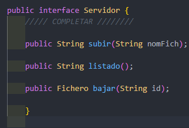

La clase Proxy lo que hace es implementar todo de la intefaz cuenta donde le  damos todas las funcionalidades a cada función, en pocas palabras darnos las instrucciones u órdenes de que hacer es decir lo que se va realizar

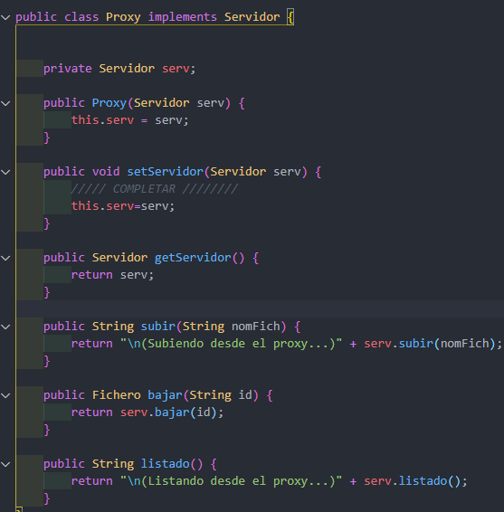

La clase ServidorFichero esta al igual que la de proxy implementa la interfaz servicio,  donde la intanciamos las funciones para poder subir un fichero y para bajarlo ademas  de hacer una función para listar todos los archivos al momento de mostrarlo.

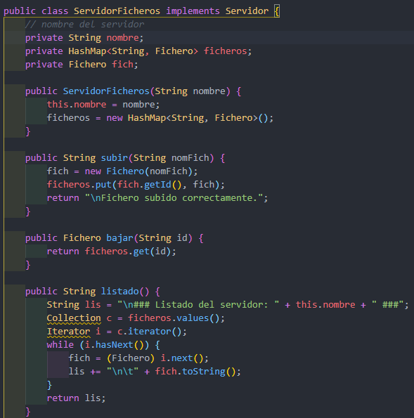

En la clase Fichero en esta lo primero que hacemos es crear las variables que utilizaremos  toda de tipo privado, despues creamos lo que es un contador esta servira para en numerar los archivos cuando hayan muchos, despues un constructor para poder crearle  el nombre cuando lo ejecutemos, poasteriormente hacemos los metodos que son los eobtenedores y establecedores para cada uno.

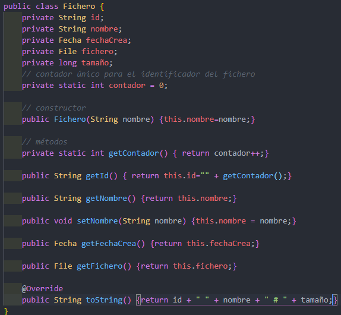

La clase fecha en esta lo primero que hacemos es declarar las variables que utilizaremos  luego crearemos lo que es un constructor lleno, este nos servira para dar  la fecha en entero,despues otro de tipo string usando la herramienta de Stringtokenizer  que sirve para dividir las cade en tokens es decir en pequeño fragmento, luego le decimos que los divida con "/" luego declaramos las 3 variables que utilizamos y la igualamos y por ultimo la convertimos a entero, despues creamos una funcion fecha esta   servira para que nos de la fecha en tiempo real y por ultimo creamos todos los  obtenedores y establecedores.

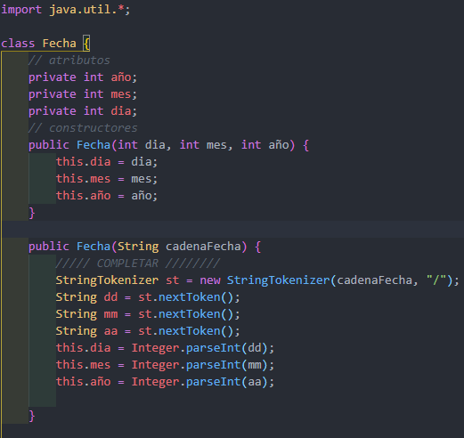
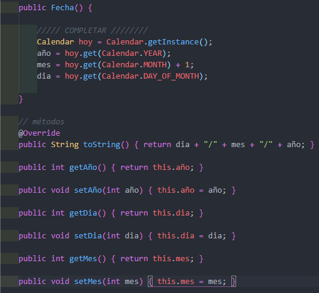

Por ultimo en el main creamos con ciclos while y do while lo que es un  menu para seleccionar la opcion que deseamos al momento de ejecución, despues lo que es las condiciones para poder subir,  bajar o listar los archivos en caso de seleccionar cualquiera de las opciones mpues hacemos llamado  del servidor que ya esta instanciado como proxy mas la opcion que necesitamos si es subir la llamamos  y le pasamos el nombre,para las otras opciones es de la misma manera y por ultimo validacion  para lo que seria mandar mensaje de error por si el usuario eligio la una opción que no existe.

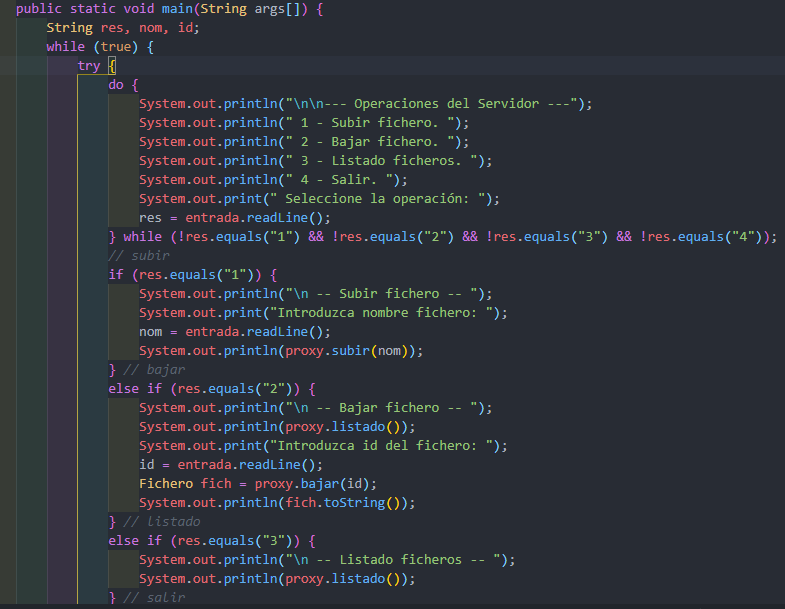
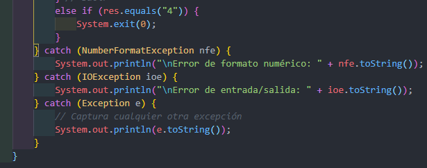

Aqui podemos ver como funciona al momento de ser ejecutado:

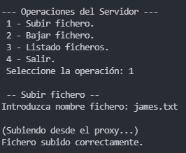
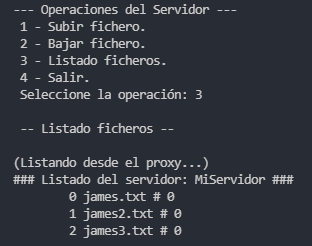
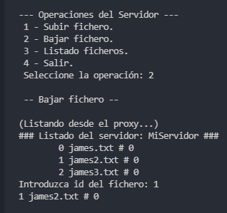